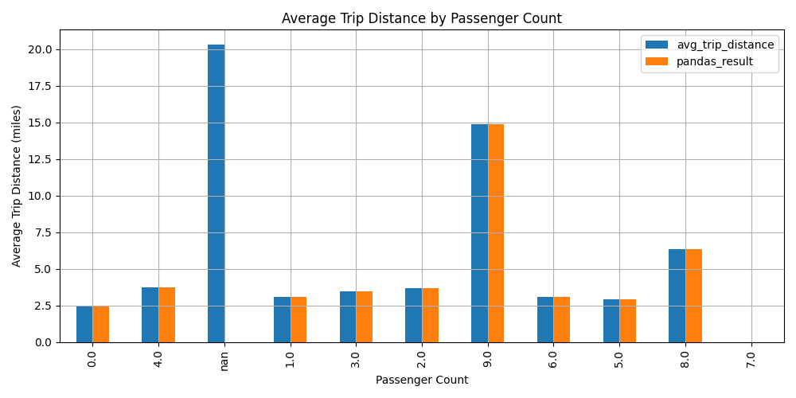

# 🚖 Benchmarking SQL Queries: Pandas vs DuckDB

This project explores the performance and efficiency of running SQL-like queries on large datasets using two popular Python tools: **pandas** and **DuckDB**.

## 🔍 Objective

To compare:
- Query execution speed
- Memory usage
- Code simplicity and readability

...when performing operations like filtering, grouping, joining, and aggregating data from the NYC Taxi dataset.

## 📂 Dataset

- **Source:** NYC Yellow Taxi Trip Records
- **Format:** Parquet
- **Size:** ~1.7GB+

## 🛠️ Tech Stack

- Python
- Pandas
- DuckDB
- Google Colab

## 📊 Key Findings

- DuckDB significantly outperforms pandas for large dataset queries, especially with complex SQL operations.
- Pandas remains intuitive but less memory-efficient.
- DuckDB offers SQL syntax directly on Parquet files without loading everything into memory.

## 📊 Benchmark Results: pandas vs DuckDB

This chart compares the **average trip distance** by **passenger count**, calculated using:

- 🟦 `avg_trip_distance` → SQL query using **DuckDB**
- 🟧 `pandas_result` → Python `groupby().mean()` using **pandas**

### 🔍 Key Observations

- ✅ **Consistent Results**: DuckDB and pandas yield nearly identical averages across passenger counts, proving accuracy and consistency.
- ⚠️ **`NaN` Passenger Count**: The `nan` category shows a **much higher average distance (~20 miles)**, suggesting records with missing `passenger_count` but non-zero trip distance. This points to possible data quality issues.
- ⚡ **Performance Edge**: While pandas is highly intuitive, **DuckDB can scale better** on larger datasets due to its SQL engine optimizations.

### 🧠 Takeaway

> For data-centric workflows, both pandas and DuckDB are accurate for aggregations. **DuckDB** offers added scalability and SQL flexibility, making it suitable for large-scale analytical pipelines.
## 🧠 Ideal For

- Data scientists and analysts working with large datasets
- Students and educators exploring database engines in Python
- Anyone comparing data processing tools for performance tuning
## 🚀 Run the Notebook

Try it live in Google Colab 👉 [Open in Colab](https://colab.research.google.com/drive/1xmc8m6Pkqx8reDYZvuf1aJgZH2j205eC?authuser=1#scrollTo=Jd4BO4irA8No)

---

Feel free to clone, contribute, or suggest improvements!
